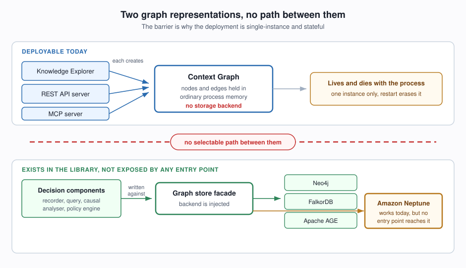
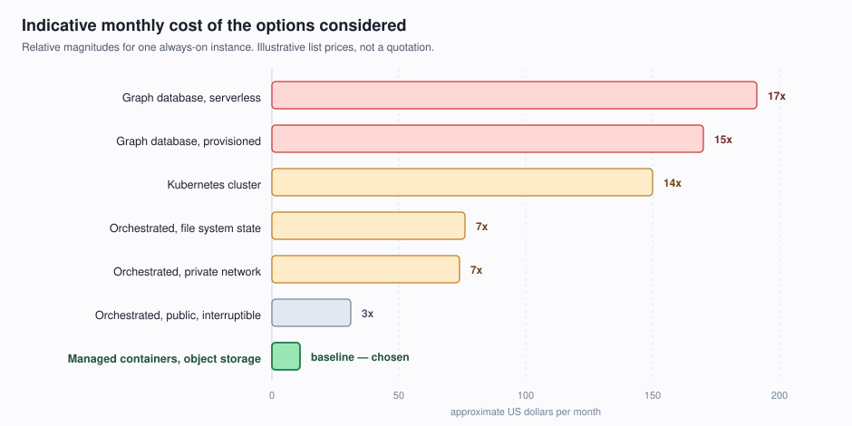
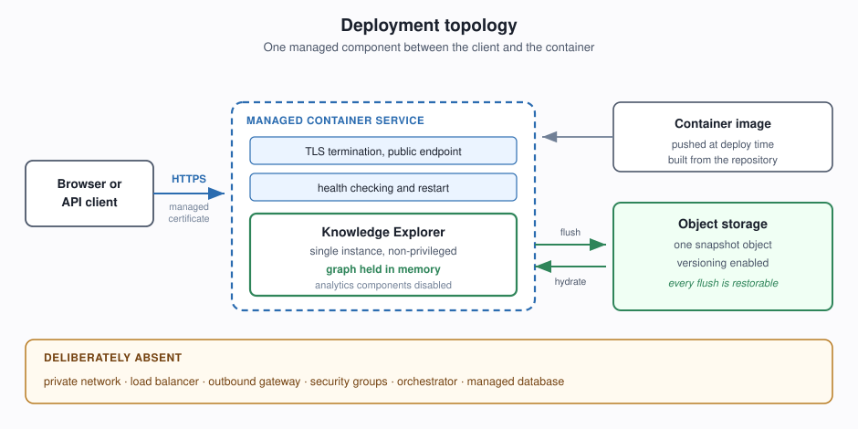
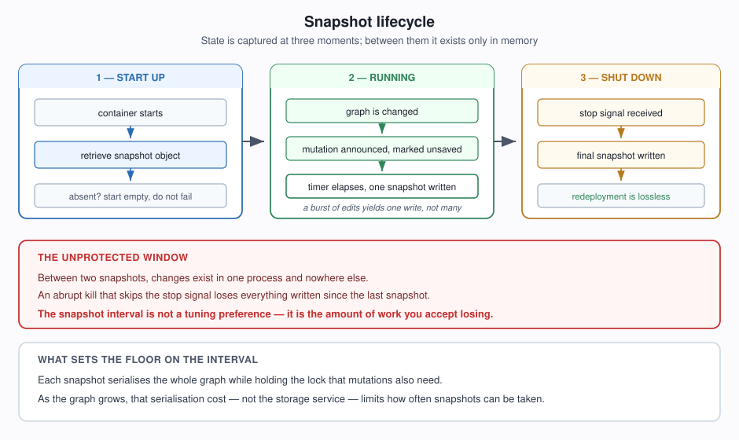

# High-Level Design — Semantica on AWS

**Status:** Proposed
**Scope:** Hosting the Semantica Knowledge Explorer on AWS, with durable graph state
**Audience:** Whoever provisions, operates, or later scales this deployment

---

## 1. Purpose

This document describes how the Semantica Knowledge Explorer is intended to run on
AWS, and — more importantly — *why* the design looks the way it does. The shape of
this deployment is dictated almost entirely by one property of the application, and
a reader who does not understand that property will find the architecture
inexplicably modest. Section 2 establishes it before anything else is decided.

The design deliberately optimises for the smallest arrangement of moving parts that
survives a restart. It is not a high-availability design, and it does not pretend to
be one. Where a more ambitious architecture is available but blocked, Section 8
records what unblocks it.

---

## 2. The Governing Constraint

Semantica ships two independent ways of representing a knowledge graph, and the
distinction between them determines everything downstream.

The first is the **context graph** — an in-process structure holding its nodes and
edges in ordinary in-memory collections, guarded by a lock. It is fast, it requires
no infrastructure, and it is the representation every shipped service instantiates
at start-up: the Explorer, the standalone API server, and the MCP server all create
one directly. It has no pluggable storage behind it. Nothing can be substituted for
its memory.

The second is the **graph store abstraction** — a thin facade over an injected
database backend, with implementations for Neo4j, FalkorDB, Apache AGE, and Amazon
Neptune. The decision-intelligence components are written against this facade and
work with any of them, including Neptune, today.

The decisive fact is that these two are not connected. The graph store abstraction
is reachable from the library, but no shipped entry point exposes a way to select
it. Every deployable surface hardcodes the in-memory context graph. Nor are the two
substitutable for one another, which Section 8 establishes and which sets the price
of ever changing this.

Three consequences follow, and they are the premises of the entire design:

**The application is stateful in process memory.** The graph is not in a database.
It exists only inside the running container.

**The deployment is limited to a single instance.** Two instances behind a load
balancer would each hold a private, diverging copy of the graph, and requests would
be answered from whichever copy the balancer happened to choose. This is a property
of the application, not of any hosting choice. No amount of AWS configuration
repairs it.

**A restart is data loss** unless state is deliberately captured and restored
outside the process.

The last of these is the only one this design can address without modifying the
application. It does so, and Section 5 explains how. The first two are accepted as
given, and Section 8 describes the change that would lift them.

---

## 3. Options Considered

Seven arrangements were examined. They are recorded here with their reasons for
rejection, because the reasoning matters more than the conclusion — several of these
become correct again once the constraint in Section 2 is lifted.

**Kubernetes on EKS.** The repository already carries a Helm chart and a set of
Kubernetes manifests, which makes this the shortest path in terms of artefacts that
already exist. It was rejected on judgement rather than cost: a cluster is a
scheduling system, and there is exactly one container to schedule. The manifests
also assume an ingress controller and carry a placeholder image digest, so the
apparent head start is smaller than it looks.

**Containers on ECS with a load balancer in a private subnet.** This is the
conventional, secure-by-default shape: the task runs with no public address, reaches
the internet through a managed gateway, and is fronted by a load balancer that
terminates TLS. It works, and it was the initial proposal. It was rejected once its
cost was decomposed: roughly two thirds of the monthly bill is the load balancer and
the outbound gateway, neither of which is doing anything a single container needs.
The container itself is the minority of the spend.

**The same, with the task moved to a public subnet and run on spare capacity.**
Removing the outbound gateway and accepting interruptible capacity cuts the bill
substantially. It remains an orchestrator plus a load balancer in front of one
process, and the load balancer alone still costs more than the entire chosen design.

**A managed graph database, provisioned.** This is the architecturally superior
answer and is discussed in Section 8. It is blocked today by the constraint in
Section 2, and it roughly triples the monthly cost.

**The same database in its serverless form.** Examined specifically because
"serverless" implies paying only for use. It does not apply here. The service has a
capacity floor that is billed continuously and never falls to zero, and at that
floor it costs *more* than the equivalent provisioned instance. Serverless pricing
rewards workloads whose peaks would otherwise force a large fixed instance; this
workload has no peaks.

**A network file system attached to the container.** Attractive because it requires
no application change at all — the existing save and load routines work against a
mounted path unmodified. Rejected for two reasons: it needs network plumbing inside
a private network that the chosen design otherwise avoids entirely, and it inherits
a flaw described in Section 5 that object storage happens to sidestep.

**A managed container service with object storage for state.** Chosen, with one
serious qualification: the service it relies on, AWS App Runner, stopped accepting new
customers on 30 April 2026. Section 4 describes the design and that constraint
together.

| Option | Relative monthly cost | Why not chosen |
| --- | --- | --- |
| Kubernetes cluster | ~14x | An orchestrator for a single container |
| Orchestrated containers, private network | ~7x the chosen design | Two thirds of spend is network overhead |
| Orchestrated containers, public, interruptible | ~3x | Load balancer alone exceeds the whole chosen design |
| Managed graph database, provisioned | ~15x | Blocked by the Section 2 constraint |
| Managed graph database, serverless | ~17x (highest) | Capacity floor never reaches zero; dearer than provisioned here |
| Managed containers, file system for state | ~7x | Network plumbing, and a durability flaw |
| **Managed containers, object storage for state** | **Baseline** | **Chosen — but the platform is closed to new customers; see Section 4** |

---

## 4. Chosen Architecture

The deployment consists of three things: a managed container service that runs one
container and terminates TLS for it, an object storage bucket that holds successive
snapshots of the graph, and a narrowly scoped role that lets the first write to the
second.

**The platform this design selects is closed to new customers, and that is the most
consequential caveat in this document.** AWS App Runner stopped accepting new
customers on 30 April 2026 and has moved to maintenance: existing services keep
running and continue to receive security and availability work, but no new features
arrive, and an account that has never held an App Runner service cannot create one.
AWS names Amazon ECS Express Mode as the replacement, and it occupies the same role
this design asks of a platform — load balancing, scaling, logging, and networking
without additional configuration.

The design itself is unaffected in its reasoning, and remains deployable on an account
that already has App Runner; the repository ships working App Runner artefacts under
`deploy/aws/`. What changed is the platform's availability, not the argument. Two parts
of this document are specific to App Runner's pricing model and would have to be
re-derived before adopting the successor: the cost comparison in Section 7 and the
billing caution at the end of it. That re-derivation is not attempted here.

There is deliberately no virtual private network, no load balancer, no outbound
gateway, and no security group. Each of those exists to solve a problem this
deployment does not have. The managed container service provides a public HTTPS
endpoint with a certificate it obtains and renews itself, performs health checks
against the container, and restarts it when those fail. That is the entire set of
platform capabilities the application requires.

The container image is the one the repository already builds. It runs as a
non-privileged user and exposes a single port, and the platform performs its own
health checks against that endpoint. No image changes are needed for
hosting; the only change is the persistence behaviour described in Section 5.

Two values are supplied to the container at deployment time as configuration. The
first is the shared secret that the application requires before it will serve any
protected route; without it the application deliberately refuses traffic rather
than serving the graph anonymously. The second is the name of the role the running
container assumes to read and write snapshots — a role reference, not a key. Section 6
explains how narrowly that role is scoped.

The reader should notice what is absent from that diagram. The entire left-to-right
path from client to container passes through one managed component. The operational
surface is a container image and two configuration values.

---

## 5. Persistence and Failure Modes

Because the graph lives in memory, durability has to be added around it rather than
inside it. The design does this at three moments in the container's life, and uses
only mechanisms the application already provides.

**On start-up**, the container retrieves the snapshot object and loads it into the
graph before serving traffic. If no snapshot exists — the first ever deployment —
the application starts with an empty graph rather than failing, which is the
behaviour its existing load routine already exhibits for a missing file. That
empty-graph path depends on one permission detail: object storage answers a request
for a missing key with an access-denied error rather than a not-found unless the caller
also holds listing permission on the bucket, and the start-up code treats access-denied
as a genuine failure and refuses to start rather than let a permissions problem be
mistaken for "no snapshot yet" and an empty graph overwrite a good one. The role
therefore needs bucket listing alongside the two object actions, or the first ever
deployment crash-loops instead of starting empty.

**While running**, every change to the graph is announced. The application already
emits a notification on each node and edge mutation, and already chains additional
listeners onto that notification so that the live-update mechanism can broadcast to
connected browsers. The persistence listener attaches alongside it, marks the graph
as having unsaved changes, and lets a timer decide when to write. Writing on a timer
rather than on every mutation is essential: a burst of edits produces one snapshot,
not one per edit.

**On shutdown**, the platform signals the container before stopping it, and the
application takes that opportunity to write a final snapshot. This is what makes an
ordinary redeployment nearly lossless — nearly, because the platform overlaps the old
and new containers, which is discussed below.

### What this guarantees, and what it does not

This is **snapshot persistence, not durable writes**. The distinction is the whole
of the risk. A change is safe only once a snapshot containing it has been written.
Between snapshots, changes exist in one process's memory and nowhere else. If the
container is killed abruptly — hardware failure, or a stop that skips the shutdown
signal — everything since the last snapshot is gone. The chosen interval is
therefore not a tuning preference; it is a direct statement of how much work the
operator is willing to lose. A thirty-second interval means a thirty-second worst
case.

Two further properties deserve to be stated plainly.

**Each snapshot rewrites the entire graph.** The application serialises every node
and edge, and it does so while holding the lock that mutations also need. For a
small graph this is imperceptible. As the graph grows, the time spent serialising
becomes the true lower bound on how frequently snapshots can be taken — the limit
is the application's own serialisation cost, not the speed of the storage service.

**Object storage replaces the snapshot atomically, and this is a genuine
improvement over writing a file.** The application's existing file-writing routine
assembles the snapshot under the lock but writes it to disk outside the lock,
without writing to a temporary name and swapping it into place. A crash midway
through leaves a truncated, unparseable file, and the next start-up would fail to
load it. Replacing an object in object storage has no such intermediate state: a
reader sees either the previous snapshot or the new one, never a partial one. The
cheaper option is also the safer one, which is not usually how that trade runs.

**Versioning turns every snapshot into a restore point.** With object versioning
enabled, the successive snapshots are retained rather than overwritten, so recovery
from a bad edit is a matter of selecting an earlier version. This is the closest
thing to a backup strategy the design has, and it costs almost nothing.

**A redeployment is not the clean hand-over it appears to be.** App Runner temporarily
doubles the provisioned instances during a deployment, so that old and new code hold
the same capacity, which means two containers briefly hold the graph. The new one
restores the snapshot at start-up, the old one writes its final snapshot afterwards,
and the new one's next timed write then replaces that — so edits the old container
accepted after the new one started are lost, and the ordering is a race rather than a
guarantee. Capping the service at one instance bounds steady state only; it does not
bound a deployment. The mitigation is procedural rather than architectural: redeploy
while the graph is idle, and leave automatic deployments switched off so that pushing
an image cannot trigger one unattended. This follows from the platform's deployment
model, so it needs re-checking against the successor platform named in Section 4.

### Failure modes

| Event | Consequence | Mitigation in this design |
| --- | --- | --- |
| Ordinary redeployment | Loses edits accepted after the new container started | Redeploy while idle; automatic deployments off |
| Container crash and restart | Loses changes since last snapshot | Bounded by the snapshot interval |
| Abrupt host failure | Same as above | Same; the interval is the exposure |
| Bad or unwanted edits | Graph is wrong | Restore an earlier object version |
| Snapshot object deleted | Graph starts empty | Versioning retains prior copies |
| Two instances run at once | Snapshots overwrite each other | One instance in steady state; unavoidable during a deployment |

---

## 6. Security Posture

**The application fails closed, and this is load-bearing.** Every route other than
health and static assets sits behind an authentication check. If the shared secret
is not configured, the application does not serve those routes unauthenticated — it
refuses them outright and says why. Misconfiguration produces an outage, not a
silently public knowledge graph. The design relies on this behaviour rather than
adding a network layer to compensate for it.

That secret is not issued by anyone. It is a value the operator generates and holds
on both sides of the request. There is no vendor account, no registration, and no
callback to any external service.

**The container reaches storage through an assumed role, so the deployment holds no
long-lived key at all.** The platform distinguishes two roles, and it is easy to
mistake the first for the whole of its support. The access role is used at deployment
time to pull the image from the registry. The instance role is separate, and it is the
one that supplies temporary credentials to the running code when it calls other
services — object storage included. This design uses the second. There is no secret
access key in the configuration, in the image, or in an operator's hands.

The role's policy is deliberately narrow. It grants object read and write on the single
snapshot object, named by its full path, rather than on a prefix or on the bucket, plus
the one bucket-level listing permission that Section 5 explains. An attacker who
reached those credentials could read and replace one snapshot of a graph that the
application already serves to any authenticated caller, and nothing else. That the
blast radius is a single object is the property worth holding on to if the policy is
ever revisited.

Two supporting measures complete the posture. Transport is encrypted end to end by
a certificate the platform obtains and renews. And the permitted browser origins are
set to the deployment's actual domain rather than left at their development
defaults, which otherwise name local addresses.

---

## 7. Cost

The chosen design is roughly one seventh the cost of the conventional orchestrated
arrangement, and the saving comes almost entirely from removing components rather
than from buying smaller ones. The container is a similar size in every option
considered; what differs is how much network apparatus surrounds it. A load
balancer and an outbound gateway together cost several times the container they
serve, and neither earns its place in front of a single process.

Storage is negligible. Snapshots are small, object storage is billed by the volume
held rather than by capacity provisioned, and the generous transfer allowance
included with the container service is far beyond what this workload will use.

One operational caution is worth recording, because it is counter-intuitive: the
container service is billed whether it is enabled or disabled, and whether or not
anything is deployed to it. Stopping the service does not stop the charge — the
service must be deleted. A deployment that is only needed intermittently should be
torn down rather than paused, which the snapshot in object storage makes safe to
do. Recreating the service and pointing it at the existing snapshot restores the
graph. This caution, and the figures above it, describe App Runner's billing model
specifically; both need re-deriving for the successor platform named in Section 4.

---

## 8. Evolution Path

The single-instance limit and the snapshot exposure window both trace to the same
root cause, and both are lifted by the same change: allowing the deployed services
to select the graph store abstraction instead of always constructing the in-memory
context graph.

The abstraction and its Neptune implementation already exist and are already
exercised against their own backends. What is missing, however, is not the choice
but a shared model between the two representations — and that gap has now been
measured rather than assumed.

Once that change lands, the architecture changes character. Graph state moves to a
managed database, so the application tier becomes stateless. Multiple instances can
run without diverging, which makes a load balancer worth its cost for the first
time and makes ordinary scaling available. Writes become durable at the moment they
are made, so the snapshot mechanism and its exposure window can be retired
entirely.

That architecture costs several times this one, and it should be adopted when the
workload justifies it — when more than one person depends on the deployment being
continuously available, or when losing the interval's worth of edits stops being
acceptable. Until then, the design in this document delivers the same functionality
for a fraction of the cost, and the migration path remains open.

### The compatibility caveat, settled

An earlier draft of this section left one caveat open: the analytical components
appeared to accept the in-memory graph and the graph store facade interchangeably,
which was observed at a single call site rather than proven across the full set of
operations.
That question has now been put to the code deliberately, and the answer is worse than
the caveat allowed for. **The two are not interchangeable, and this evolution path
cannot be delivered as a substitution.**

The two classes share no base class, no abstract base and no protocol; each derives
directly from the language's root object. They have six public methods in common, and
the two that matter most disagree: neighbour lookup takes a hop count as its second
argument on one and a relationship type on the other, and the query method performs a
keyword substring search over node content on the in-memory graph while executing
Cypher on the facade. Handing a Cypher string to the in-memory graph therefore returns
rows — two of them in the case measured, matched because the query text happened to
occur in the node content — and raises nothing. That is the failure mode the caveat did
not anticipate: not an error surfacing when some operation is first exercised, but a
plausible-looking wrong answer.

Such interchangeability as does exist elsewhere is hand-rolled method by method rather
than supplied by an interface, and it is applied inconsistently. Twelve call sites in
the decision recorder and the decision query branch on the object's exact type — so
even a subclass of the in-memory graph is routed to the Cypher branch and fails there —
while five of six methods probed on the causal analyser carry no in-memory branch at
all and simply raise an attribute error.

The decisive gap, though, is the data model rather than the method names. Bi-temporal
validity — the valid-from, valid-until and active-flag fields that every node and edge
in the in-memory graph carries, and on which retraction, active-view queries and
temporal version grouping all depend — appears over two hundred times in the in-memory
implementation and not once anywhere in the graph store package or the backends behind
it. An adapter does not bridge that: it would have to carry a temporal model no backend
can represent and materialise in memory the node collection that callers read as a
plain dictionary, which is a reimplementation of the in-memory graph sitting on a store
that cannot hold its model. And it would still leave the query method's two meanings
unresolved, because that one is a semantic collision rather than a missing method.

**The consequence for this design is narrower than that sounds, and worth stating
precisely.** Nothing is broken today. The REST API and the Explorer hold an in-memory
graph declared as such, and the live routes exercise only the methods that branch
correctly, so the incompatibility is latent rather than active. The snapshot mechanism
in Section 5 attaches to the existing mutation notification and operates on the
in-memory graph directly, so it is unaffected. What changes is the standing of this
section. Moving graph state into a managed database means reconciling two graph
models, choosing a single meaning for the query method, and either implementing
bi-temporality on the backend or deciding deliberately to lose it. It remains the
right direction and the migration path remains open; it is not a configuration switch
and should not be budgeted as one.

One finding bears directly on the persistence work in Section 5. Because those
dispatch sites compare exact types, a snapshot-aware or mutation-tracking wrapper
around the in-memory graph must not be written as a subclass of it, or the wrapper
will be routed to the Cypher branch and fail there. Section 5 attaches to the existing
mutation notification instead of wrapping the class, which avoids the trap.

---

## 9. Known Limitations

**The chosen platform is closed to new customers.** AWS App Runner entered maintenance
on 30 April 2026, so this design can be deployed only on an account that already holds
an App Runner service. Section 4 records the successor AWS names and what would have to
be re-derived to move to it.

**The deployment cannot scale horizontally.** This is a property of the application,
not of the hosting choice, and no configuration of any platform repairs it.

**Durability is bounded by the snapshot interval**, as described in Section 5, and a
redeployment overlaps two containers, which the same section describes.

**The container image is far larger than the workload requires.** The package
declares substantial machine-learning libraries as mandatory dependencies, and the
image therefore carries them even though the Explorer disables the components that
would use them and never imports them at run time. This costs deployment time and
registry storage on any host. It cannot be reduced without restructuring how the
package declares its dependencies, which is out of scope here.

**The cost figures are indicative.** They are drawn from published list prices for a
single region and are intended to convey relative magnitude. They are not a
quotation and should be confirmed against current pricing for the target region
before any commitment.

---

## 10. Summary

The application holds its graph in process memory and no deployable entry point
offers an alternative. That single fact makes an orchestrator, a load balancer, a
private network, and a managed database all unjustifiable — each solves a problem
that a single stateful container does not have.

The design therefore runs one container on a managed service that supplies TLS,
health checking, and restart, and adds durability around the application by
capturing the graph to object storage at start-up, on a timer, and at shutdown. It
accepts a bounded window of potential data loss as the price of being an order of
magnitude cheaper and considerably simpler to operate, and it reaches storage through
a role scoped to one object rather than through any stored key.

Two things qualify that. The platform it runs on stopped accepting new customers on
30 April 2026, so an account without an existing App Runner service must first adopt
the successor named in Section 4 — which leaves the reasoning here intact but requires
the cost and billing sections to be re-derived. And when the application gains the
ability to hold its graph in a database — substantial work rather than a configuration
switch, for the reasons Section 8 records — this design should be revisited. Until
then, and on an account that has App Runner, it is proportionate to what is being
deployed.
