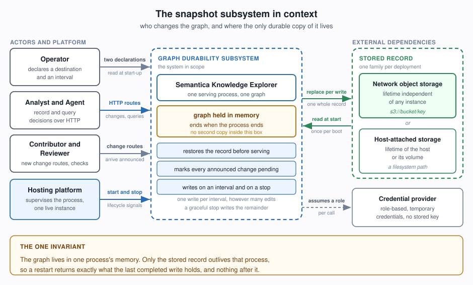
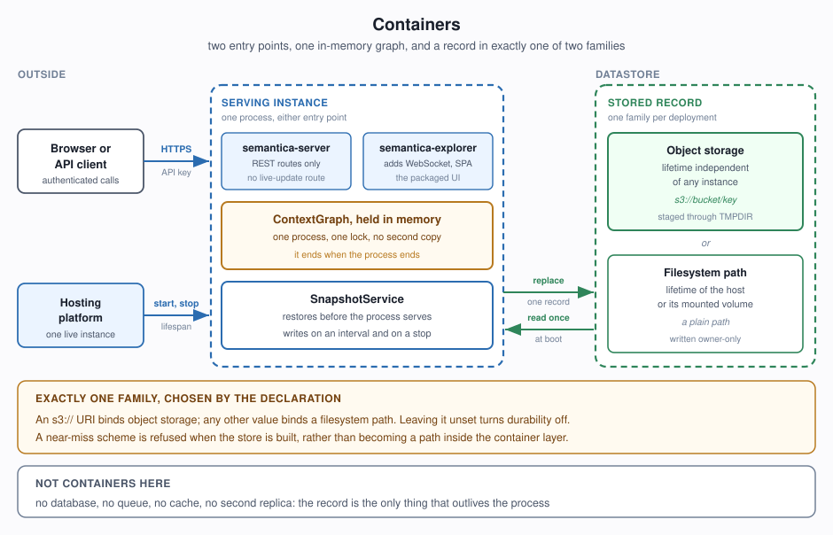
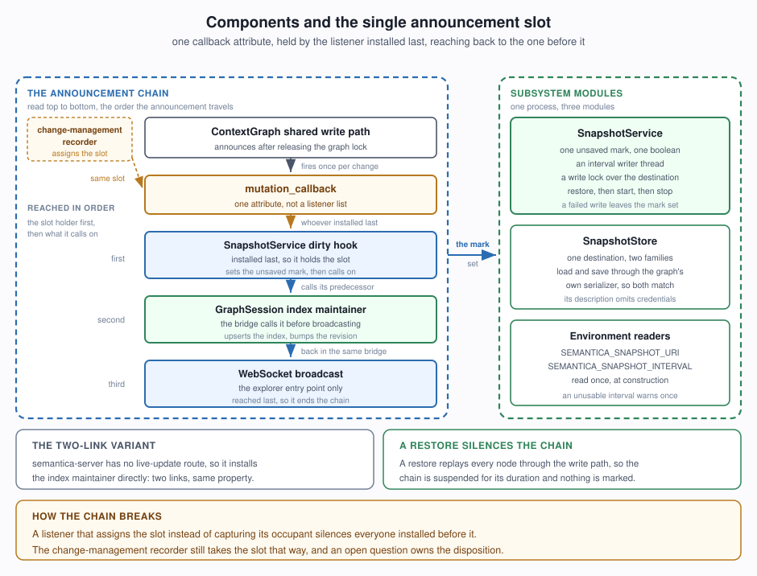
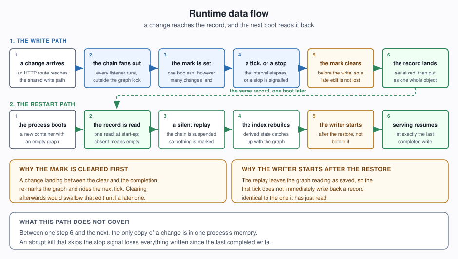

# Snapshot Persistence and Change Detection — Design

**Layer:** design for the snapshot persistence and change-detection subsystem
**Status:** Proposed
**Audience:** engineers ratifying the decisions, reviewers interrogating them, operators reading the contracts

The sibling `docs/design/aws-integration/README.md` is the hosting high-level design and the consumer
of this subsystem. It settles the hosting choice and the alternatives weighed against it, the cost
model, the security posture, the single-instance constraint, and the known limitations; this document
cites those by section name — *The Governing Constraint*, *Options Considered*, *Chosen
Architecture*, *Persistence and Failure Modes*, *Security Posture*, *Cost*, *Evolution Path*, *Known
Limitations* — rather than restating them. Where this document needs a code location it names a
component; where it needs an external contract — an environment variable, a URI shape, an IAM action,
a payload key — it states it verbatim, because those are the surface other systems bind to.

---

## Context

The recorded graph — nodes, edges, decisions, policies, precedents, retractions, and the bi-temporal
validity carried on each of them — lives in the collections of one running process, behind one
re-entrant lock. That is the property that makes it fast to traverse and free of infrastructure, and
it is the entire exposure: the record exists in one place, and that place ends when the process ends.
The hosting design's *The Governing Constraint* section derives the deployment shape from this,
including the single-instance property; that reasoning is taken as given here.

The review that commissioned this design put both halves of the hosting design's "every change is
announced, and the persistence listener attaches alongside" sentence to the code. Each half held for
the paths anyone had exercised and gave way on one path nobody had. **Both defects are the reason to
read the invariants below**:

- **A change route reached the graph while bypassing the announcement.** The duplicate-merge route
  behind `/api/enrich/merge` rebuilt the edge list, the adjacency map and the type indexes by direct
  assignment and removed the duplicate from the node collection — every step travelling around the
  graph's write methods, so the pending mark stayed clear and a restart resurrected a duplicate an
  analyst had already resolved. The promise had silently narrowed from "your edits survive a restart"
  to "the edits made through the routes someone remembered to announce". INV1 is that defect,
  generalized.
- **The announcement slot turned out to be winner-takes-all.** `mutation_callback` is a single
  attribute holding a single callable. A consumer that assigns to it without capturing the previous
  occupant silences every consumer already there — and a second consumer, `GraphSession`, reads *mere
  occupancy* of the slot as a promise that somebody else is maintaining the search index and advancing
  the revision counter readers poll. In `semantica/server.py` the second occupant therefore disabled
  search-index maintenance silently. INV2 and INV3 are those two readings of occupancy, stated
  separately so neither can be satisfied alone.

A third property makes this a design problem rather than a bug list. Writing the whole record on every
change is affordable only for a small record, so writes ride a timer, and a timer is a promise about
time. The interval an operator declares is a statement of the work they accept losing, so the
subsystem owes them a bound they can hold it to and a check that fails when the bound stops holding.

---

## Scope

- One stored record per deployment, holding the whole recorded graph: nodes, edges, decisions,
  policies, precedents, retractions, and the temporal validity carried on each.
- One destination per deployment, from two families behind one declaration — a filesystem path, or an
  object key in network storage — with the family fixed at construction.
- Two operator inputs: the destination and the interval. Declaring a destination turns durability on;
  leaving it undeclared keeps the system fully usable in memory for a session that wants exactly that.
- Restore before serving, coalesced interval writes, and one final write on a graceful stop, at every
  serving entry point the project ships.
- The announcement slot occupied additively, released cleanly, and installed in an order that keeps
  the index maintainer reachable.
- The pending mark as the single durability signal, cleared before a write and re-set by a failure.
- One serializer producing one record format for both families, with whole-record replacement at both,
  and the record owner-only where permissions exist.
- Absence distinguished from failure by storage error code, with start-up stopped for every failure.
- A runnable check behind every durability claim this document makes.

---

## Architecture

Three C4 levels, ascending, each zooming into exactly one named box from the level above. A
**container** is a runtime deployable, so the stored record's two destination families are
containers; a **component** is a module inside one container, so the interval writer, the destination
adapter and the announcement slot are components. Class and sequence detail is left out at this
altitude, with one exception: the runtime data flow, because the ordering it shows is the subject of
three of the decisions below and needs a diagram to be ratifiable.

### Level 1 — Context



### Level 2 — Containers

Zooming into the **Graph durability subsystem** box. One deployment binds one of the two record
containers, chosen by the shape of the operator's declaration; the platform, the secret store and the
single-instance pinning are settled in the hosting design's *Chosen Architecture* and *Security
Posture* sections.



### Level 3 — Components

Zooming into the **Serving instance** container.



**Install order and traversal order are opposites, and this is the part that has been gotten wrong
twice.** The slot's occupant is the listener installed **last**, and each occupant reaches the one
installed before it. Concretely:

- The lifespan installs the `GraphSession` mutation bridge **first**, so it ends up deepest in the
  chain and stays reachable — this is what makes INV3 hold.
- The persistence dirty hook installs **last**, so it **holds** the slot and is therefore **reached
  first** on every announcement. It sets the mark, then calls its captured predecessor.
- The bridge calls the `GraphSession` index maintainer **before** it broadcasts, so the index and the
  revision counter are updated ahead of the live-update fan-out.
- The **WebSocket broadcast ends the chain**. Nothing is installed behind it.

One entry point ships without a live-update route and installs the index maintainer's handler directly
instead, producing a two-link chain with the same property and the maintainer at its end. The
change-management recorder is drawn dotted because it wants the same slot and currently takes it by
assignment; bringing it onto the chaining convention is listed under *Future directions*.

### Runtime data flow

One end-to-end path: a change arrives, the announcement fans out, the mark is set, a tick or a stop
decides to write, the record is serialized and replaced, and the next boot reads it back.



Two orderings in that diagram are decisions rather than incidentals, and both are stated as
constraints below: the mark is cleared *before* the write (INV5), and the writer starts *after* the
restore (D5).

---

## Rules and invariants

These twelve statements are the design. Two have a real HIGH-severity defect behind them — INV1 and
the INV2/INV3 pair, both described in *Context* — which is why they are constraints, not commentary.

**INV1 — A change is durable exactly when it routes through the graph's change-emitting path.**
This is the invariant the reviewed `/api/enrich/merge` defect violated. Announcing is the
responsibility of the graph's shared write path rather than of each caller, so a route built on that
path arrives announced by construction. A route that assigns to the collections directly is durable
only when it announces explicitly at the same moment, under the same lock, as part of the same
change. Any new route therefore has two acceptable shapes and no third: go through the shared write
path, or announce beside the direct manipulation. A route with neither is invisible to durability
while looking completely healthy — the graph accepts it, readers see it, and a restart erases it.

**INV2 — Occupancy is additive.** Any number of consumers observe change simultaneously. An occupant
captures the predecessor, calls it on every announcement, and hands the slot back intact when it
leaves. Install order therefore decides the chain's shape, and the last installer wraps the earlier
ones.

**INV3 — Occupancy of the slot is currently a proxy for a different consumer's
responsibility.** `GraphSession`, which owns the search index and the revision counter, treats an
occupied slot as a promise that the chain reaches its own handler, and skips its own index and
revision bookkeeping accordingly. The consequence is a hard constraint: the persistence listener may
occupy the slot only as part of a chain that reaches the index maintainer. Occupying it alone
leaves the graph accepting writes that stay unsearchable while the revision counter readers poll
stands still.

**INV4 — The guard lives on the graph, the mark on the service.** A graph outliving one service must
still receive a fresh mark from the next, which is why release clears the guard and why only an
installer restores.

**INV5 — The mark is cleared before the write and re-set by a failure.** Clearing afterwards would
swallow a change that landed mid-write until some unrelated later change; re-setting on failure makes
the following interval the retry.

**INV6 — Serialization happens under the graph lock; transmission happens outside it.** The payload
copies the mutable dictionaries it names, so an in-place edit during the dump leaves the record whole,
and a network round trip leaves every change free to land.

**INV7 — At most one write to a destination is in flight.** Object storage resolves competing writes
to one key by completion order, so an overlapping final write could otherwise finish first and leave
the older payload stored while reporting success.

**INV8 — A replay announces nothing, restores the previous suspension value, and leaves the graph
reading as saved.** Nesting a replay inside an already-suspended region leaves the outer region
suspended. The pending mark is clear immediately after a restore, so the first tick does not rewrite
a record identical to the one just read.

**INV9 — The destination holds one whole record at every instant.** For the file family this is a
same-directory temporary file plus a rename, which requires write permission on the destination's
*directory* rather than only on the file, and requires the temporary file to share the destination's
filesystem. For the object family it is the storage service's replacement semantics.

**INV10 — One live holder per stored record.** Two holders of one destination overwrite each other.
Steady state is enforced by the deployment's single-instance scaling; a redeploy overlap is the known
exception, described in the hosting design's *Persistence and Failure Modes* section and handled
procedurally.

**INV11 — Absence is decided on the storage error code, and every other outcome stops start-up.**
The transport status is ambiguous, since a missing bucket reports the same status as a missing key,
and treating a permissions problem as absence would let an empty graph be written over a good record
on the following tick. An absent record means "first run" and yields an empty graph; a refused read,
a missing bucket, a throttle, and a truncated or unparseable payload all raise out of start-up and
leave the stored record byte-identical.

**INV12 — The interval is fixed for the life of the service.** It is read once at construction, so a
restart is what adopts a new value.

---

## Durability boundaries

Which paths mark the graph pending, how much a sudden loss costs, and where the promise stops.

| Moment | Behavior |
| --- | --- |
| **Start-up** | Restore, then the writer, in that order. The restore calls one caller-supplied refresh hook exactly once, and only when a record was actually restored. |
| **First-ever start** | An absent record warns at warning severity — naming the destination, so the line survives a log configuration that drops informational records — and yields an empty graph. |
| **Serving, per change** | A change through the shared write path, or a direct-manipulation route that announces explicitly, sets the mark. A direct-manipulation route that announces nothing does not, and that is the whole of INV1's exposure. |
| **Serving, per interval** | Exactly one write per interval that contains at least one change; zero writes for an interval with none. The system decides when to write; the operator's only inputs are the destination and the interval. |
| **Graceful stop** | Sets the stop event, joins the writer under a bounded timeout, hands the slot back, and *then* writes if the mark is set — the hand-back precedes the write so nothing re-marks during it. A clean graph is left alone, since it already matches what is stored. Every change accepted before the stop is preserved. |
| **Abrupt loss** | Everything up to the last completed write returns on the next start. The loss beyond it is bounded by the declared interval, which is the number the operator stated; at the default that is a thirty-second worst case. |
| **Redeploy overlap** | The platform runs the old and new containers concurrently, so the new holder's restore can be overwritten by the old holder's final write. INV10 is an assumption here rather than an enforcement, and the mitigation is procedural. |
| **A failed write** | Keeps the pending mark, retries at the following interval, keeps the writer running, and reports at error severity with the destination named. The interval is the back-off; a separate retry schedule would widen the window. |
| **No destination declared** | Wiring stays unconditional and every durability method returns immediately, so a serving process with the subsystem present and idle behaves exactly like one without it. |
| **A destination declared with no graph to snapshot** | Persistence disables and says so at warning severity, naming the destination, rather than serving a healthy process that stores nothing silently. |
| **An explicit graph plus a declared destination** | The explicit graph serves, the outranking is announced at warning severity, and later changes are written to the declared destination. |
| **Misconfiguration** | An unusable interval warns once and falls back to the default. A destination shape that resolves to neither family raises at construction. The destination is the promise; the interval is the dial. |

---

## Key design decisions

Hosting-level alternatives — the platform, the storage family's cost, the network posture — are settled
in the hosting design's *Options Considered* and *Chosen Architecture* sections, and cited not re-argued.

### D1 — Change detection is one attribute slot that consumers chain onto

This is the decision that matters most. Announcements travel through `graph.mutation_callback`, a
**single attribute holding a single callable** — not a listener list. Three consumers in the codebase
contend for it: the persistence dirty hook, the `GraphSession` mutation bridge (search index,
revision counter, WebSocket broadcast), and the change-management recorder. Each is expected to
capture whatever was there, install a wrapper, and call the captured predecessor; **whoever installs
later wraps the previous occupant**.

**Alternatives considered.**

| Alternative | Why v1 declined it |
| --- | --- |
| **An explicit listener list** on the graph, with add and remove | The clean answer, and the wanted end state. It changes a published attribute that three consumers and a body of tests already bind to, and it lands in the graph module rather than in this subsystem, widening the change well past durability. v1 buys the guarantee with a convention plus a check that the convention held; the registry buys it with a mechanism, later. |
| **An explicit "the index is maintained by X" flag**, so occupancy stops standing in for a second promise | Treats INV3's symptom precisely and cheaply. It also adds a second piece of shared mutable state whose agreement with the first is unenforced, which trades one coupling for two. Worth revisiting alongside the registry. |
| **Polling a content hash of the graph** on the interval, with no callback at all | Removes the contention entirely and covers INV1 by construction: a route that bypasses the write path still changes the content. It also costs a full serialization per tick to compute the hash, and serialization is already the true bound on how often writes can happen — so the cheapest possible tick becomes the most expensive one. It also gives no signal to the index maintainer, which needs the payload rather than a dirty bit. |
| **A monotonically increasing revision counter** on the graph, sampled by the writer | Cheap to read, and one already exists on the session for readers to poll. It sits on the session rather than on the graph, so it inherits the same coverage question as the callback, and it still leaves the index maintainer needing the payload. A counter on the graph itself would be a graph-module change of the same size as the registry, with less of the benefit. |
| **Wrapping or subclassing the graph** so writes are intercepted structurally | Rejected on evidence rather than taste. The hosting design's *Evolution Path* section records that twelve call sites in the decision recorder and the decision query branch on the object's *exact* type, so a subclass is routed to the database branch and fails there. That section states the conclusion directly: attach to the announcement instead of wrapping the class. |

**What the chosen shape costs, stated plainly.** Occupancy is winner-takes-all, so a consumer that
assigns without capturing silences the chain, and one of the three consumers does exactly that.
Install order decides both correctness and what survives a release. Occupancy carries INV3's second,
unrelated meaning. And the guard-on-graph / mark-on-service split in INV4 exists only because the
slot is shared this way. These costs are the price of leaving the graph's published surface alone in
v1, and the route-parity and coexistence checks exist to make each of them observable rather than
latent.

### The remaining decisions, with the alternative each one beat

**D2 — Writes ride a timer and coalesce, rather than following each change.** *Write per change* is
losslessly durable and unaffordable, since every write rewrites the whole record. *An idle-debounce
timer* gives a bound that depends on traffic shape rather than a number the operator declared; *a
change-count or payload-size threshold* makes the loss budget unstateable in seconds; *an append-only
change log* is the right answer for a shorter window and is later work. One declared number is what
lets an operator state a bound and hold the system to it.

**D3 — One serializer produces the record for both families.** The object destination stages the
payload through a temporary file written by the same routine the file destination uses, then streams
it to the key. *Two serializers*, one streaming straight into the upload, saves a copy and forks the
payload format the moment either side changes, so a record written by one destination could stop
loading from the other. *A delta format* needs a change log beyond this record; *a binary format*
costs the property that an operator can read a record with ordinary tools. The staging copy is the
acknowledged cost, charged against the temporary filesystem — hence `TMPDIR` below.

**D4 — Absence and failure are distinguished, and absence is decided on the error code.** *Treating
every read failure as absence* starts an empty graph on a permissions problem and writes it over a
good record on the next tick — data loss reported as a successful start-up. *Probing for existence
first* costs a round trip and a permission per boot, and the probe's own failures need the same
classification anyway. *Requiring an operator flag before an empty start* makes the first-ever
deployment a two-step operation. Deciding on the code is why the role needs bucket listing, below.

**D5 — Restore runs before the writer starts, with announcements suspended.** *Starting the writer
first* makes the replay mark the graph pending, so the first tick rewrites an identical record and
"the graph is clean after a restore" becomes unassertable. *Filtering replay announcements in each
consumer* means a new consumer arrives without the filter; *a replay-specific operation type*
multiplies the announcement vocabulary for one caller. Suspension is one flag that restores its
previous value, so nesting works.

**D6 — The writer is a background daemon thread on a stoppable wait.** *An event-loop task* is
natural for asynchronous entry points, and the write is blocking network I/O that would stall the
loop, with the thread-offload helper it needs sitting above the library's Python floor. *An external
scheduler invoking a write endpoint* moves the timer out of the process that owns the mark, so the two
can disagree; *writing inline on the request path* puts serialization latency in front of the user. A
stoppable wait rather than a sleep is what makes a stop prompt; daemon rather than joined-at-exit is
what keeps a hard kill from waiting on the writer.

**D7 — Two locks: one for the destination, the graph's own for serialization.** *Reusing the graph
lock for the whole write* blocks every change for a network round trip. *No destination lock, relying
on the bounded join at stop* leaves a final write free to overlap an in-flight one, and object
storage resolves by completion order, so the older payload can end up stored while the write reports
success. *A version precondition at the destination* is the correct distributed answer and buys
nothing while INV10 holds one live holder.

**D8 — The record lands owner-only by the write, with the mode passed explicitly.** *The process
umask default* makes the tightness of the whole decision record depend on ambient configuration. *An
operator chmod after first write* is a manual step a fresh volume silently skips. *A directory-level
policy* protects the directory, and the record is the asset. Passing the mode explicitly also covers
the case that matters most in practice: overwriting a looser file left by an older build, a restore,
or an unpacked archive. The general-purpose write path keeps a mode-preserving default so a user's
own save is left as they had it, and the durability write opts in.

**D9 — The subsystem attaches to the announcement rather than wrapping the graph.** A subclass, a
proxy, or decorated write methods are all routed to the database branch by exact-type dispatch at
twelve call sites — the hosting design's *Evolution Path* section records the trap and states the
avoidance directly. The graph is a parameter to the destination adapter and to the service alike.

**D10 — The destination family is decided once, at construction, from the declaration's shape.** A
declaration beginning with the object scheme is split into a bucket and a key, and a key naming nothing
raises; a scheme separator or a near-miss of the object scheme raises rather than resolving to a path;
anything else is a filesystem path. *Accepting any unparseable string as a path* turns a mistyped
scheme into a path inside the container's ephemeral layer, so the service logs a destination, writes
every interval and reports success while storing into what the next restart discards. *A separate
family selector variable* is two declarations that can disagree; *a scheme registry* is machinery for
two families.

**D11 — An unusable interval degrades to the default; an unusable destination refuses.** *Raising on
both* trades a slightly wrong write cadence for a total outage over a tuning knob; *warning on both*
reduces a destination that goes nowhere to one log line. An unset interval warns about nothing, since
an unset optional knob is a default rather than a misconfiguration.

**D12 — Wiring is unconditional; a missing destination makes every method a no-op.** *Conditional
wiring at each entry point* writes the condition twice, in two lifespans, and drifts; *a null-object
destination adapter* is one more type for one behavior; *requiring the declaration* removes the
in-memory session that *Scope* keeps.

---

## Interfaces and data contracts

### Operator surface — environment

| Variable | Meaning | Parsing | Default |
| --- | --- | --- | --- |
| `SEMANTICA_SNAPSHOT_URI` | The destination. Declaring it turns durability on. | Trimmed. Empty or absent leaves durability off. An object URI is split into bucket and key. A near-miss scheme raises at construction (D10). Anything else is a filesystem path. | absent — durability off |
| `SEMANTICA_SNAPSHOT_INTERVAL` | Whole seconds between writer ticks; the declared loss budget. | Trimmed. Absent yields the default silently. A value other than a positive whole number warns once and yields the default (D11). Read once at service construction (INV12). | `30` |
| `TMPDIR` | Where the object family's staging copy lands. Must be disk-backed and sized for the serialized record; a hardened temporary filesystem with a small cap fails every tick — safely, and indefinitely. | OS default | OS default |

The deployment template's own accepted shape for the destination is
`^s3://[a-z0-9][a-z0-9.-]{1,61}[a-z0-9]/.+$` — one bucket, one key, matching D10's refusal of a
bucket-only declaration.

Adjacent variables the serving process reads but this subsystem does not own: `SEMANTICA_API_KEY`
(unset means 503, the fail-closed property the hosting design's *Security Posture* section relies on),
`SEMANTICA_ALLOW_ANONYMOUS` (development-only), and `SEMANTICA_CORS_ORIGINS`.

### Destination grammar

```text
destination      = object-uri | filesystem-path
object-uri       = "s3://" bucket "/" key        ; key may itself contain "/"
filesystem-path  = any value free of "://" and of an "s3:" prefix
absent           = unset, empty, or whitespace-only   ; durability stays off

accepted    : s3://my-bucket/graphs/context.json
accepted    : /data/graph-snapshot.json
accepted    : relative/path.json
refused     : s3://my-bucket            ; names a bucket, no key
refused     : s3:/one-slash/key         ; near-miss scheme
refused     : S3://my-bucket/key        ; near-miss scheme
refused     : s3a://my-bucket/key       ; near-miss scheme
refused     : https://host/key          ; a scheme outside the two families
```

A refusal raises a validation error naming the variable and the value received. The description a
destination reports for the start-up log line is `file <path>` or `s3://<bucket>/<key>`, and carries
no credential by construction.

### Stored record payload

One JSON object, written with two-space indentation and non-ASCII characters preserved. Keys in
writing order:

```json
{
  "graph_id": "graph-1",
  "nodes": [
    {"id": "decision-42", "type": "decision",
     "properties": {"content": "adopt the managed container option",
                    "valid_from": "2026-08-25T10:00:00",
                    "valid_until": "2026-09-01T10:00:00"}}
  ],
  "edges": [
    {"id": "content-addressed-uuid5", "familyId": "content-addressed-uuid5",
     "source_id": "decision-42", "target_id": "decision-43",
     "type": "CAUSED", "weight": 1.0, "properties": {},
     "valid_from": "2026-08-25T10:00:00"}
  ],
  "links": [
    {"link_id": "link-1", "source_node_id": "decision-42",
     "target_node_id": "external-7", "other_graph_id": "graph-2"}
  ],
  "retractions": [{"entity_id": "decision-9", "entity_kind": "node"}],
  "tombstones": [{"entity_id": "content-addressed-uuid5", "entity_kind": "edge"}]
}
```

Contract points worth binding to:

- **Bi-temporal validity travels with the entity.** `valid_from` and `valid_until` appear on a node
  inside its `properties`, and on an edge at the top level; each appears only when it carries a
  value. This is the model the hosting design's *Evolution Path* section measured as absent from
  every database backend, which is why the record is the subsystem's own format rather than a
  backend's.
- **Edge identity is content-derived**, and `familyId` groups the temporal versions of one logical
  edge, defaulting to the edge's own identity.
- **Deletion metadata is part of the record.** `retractions` and `tombstones` are lists rather than
  objects, because the in-memory key is a kind-and-id pair that JSON has no shape for and each record
  already carries both halves. A record written before these keys existed loads with none of them,
  which keeps an older record loadable.
- **Reading is tolerant, writing is exact.** A bare array loads as nodes, or as edges when its first
  element carries endpoint keys; `entities` and `vertices` are synonyms for `nodes`, and
  `relationships` and `links` for `edges`. Writing always emits the six keys above.
- **A restore replaces rather than merges.** Loading clears the collections, the indexes, the link
  registry and the deletion metadata first, so the graph after a restore is the record and nothing
  else.

### Announcement contract

Every consumer of the slot receives the same three arguments: `(operation, entity_id, payload)`,
where `payload` is a plain dictionary — for a node or edge change, the same shape the record uses for
that entity.

Six operations are **emitted**, all of them from the shared write path: `ADD_NODE` and `UPDATE_NODE`
(a node lands, an attribute is set, or a node is retracted) and `REMOVE_NODE` (purged, or merged away
by a route that announces it directly) each upsert or remove in the search index and bump the
revision; `ADD_EDGE`, `UPDATE_EDGE` and `REMOVE_EDGE` bump the revision only.

Four further names are **accepted** by the Explorer's consumer without any write path emitting them.
`RELOAD_GRAPH` the consumer announces to itself from its own post-restore refresh hook, rebuilding
the whole index. `RESET_GRAPH`, `DELETE_NODE` and `DELETE_EDGE` are reserved synonyms — for
`RELOAD_GRAPH`, `REMOVE_NODE` and `REMOVE_EDGE` respectively — kept so an emitter that prefers the
other verb still lands on the right handler.

Three properties of the fire sites matter to any consumer.

- **The shared write path announces after releasing the graph lock**, so a consumer runs outside it
  and may take its own locks. Node and edge additions, attribute writes, retractions and purges all
  behave this way.
- **A direct-manipulation route announces while it still holds the lock**, deliberately: the
  duplicate-merge route rebuilds the edge list and the indexes and removes the node under the lock,
  and announces there too, so the writer thread cannot observe an edge list already replaced while the
  node is still present. INV1 is satisfied either way; the lock discipline is the route's to choose.
- **An exception raised by a consumer is caught and logged as a callback failure**, so a consumer's
  fault leaves the change itself standing. A consumer that swallows its own errors therefore makes
  itself invisible, which is why a failed write is reported at error severity.

### Service surface

The callable contract the two serving lifespans bind to.

| Operation | Shape | Behavior |
| --- | --- | --- |
| `SnapshotService.from_env(graph, after_restore)` | classmethod → service | Builds from the environment. A declared destination with no graph disables persistence and warns, naming the destination. |
| `service.restore()` | → `bool` | Announces the destination, replays with announcements suspended, calls `after_restore` once on success. `True` when a record was restored. |
| `service.start()` | → the service | Clears the stop event, installs the listener, starts the writer. A no-op with no destination, or with a writer already alive. Returns self, so a lifespan builds and starts in one statement. |
| `service.stop()` | → `None` | Sets the stop event, joins the writer under a bounded timeout, hands the slot back, then writes if the mark is set. |
| `service.snapshot_if_dirty()` | → `bool` | One tick, exposed so a check can drive it directly. `True` when a record was written. |
| `SnapshotStore(uri, client=None)` | constructor | Fixes the destination family (D10). The client parameter exists so a check can supply its own. |
| `store.load(graph)` | → `bool` | `True` when a record was restored, `False` for absence, raising for every other outcome. |
| `store.save(graph)` | → `None` | Replaces whatever is at the destination with one whole record. |
| `store.description` | property → `str` | The destination as a log line, credential-free. |
| `snapshot_store_from_env(env=None)` | → `Optional[SnapshotStore]` | `None` when the destination is undeclared. |
| `snapshot_interval_from_env(env=None)` | → `int` | Whole seconds, degrading to `DEFAULT_SNAPSHOT_INTERVAL` (D11). |
| `suspended_mutations(graph)` | context manager | Silences announcements for the block, restoring the previous value (INV8). |
| `graph.save_to_file(path, mode=None)` / `graph.load_from_file(path)` | → `None` | The one record-producing pair (D3). `mode=None` preserves an existing destination's bits; the durability write passes `0o600`. |
| `graph._emit_mutation(operation, entity_id, payload)` | → `None` | The explicit announcement a direct-manipulation route uses to satisfy INV1. |

---

## Runtime and permission model

Thread inventory per process: one background writer, named for discoverability so a check can assert
its absence after a stop; daemon, so a hard kill proceeds; one stop event; one destination write lock.
The writer thread is the destination's single writer, and the write lock is what keeps that true even
when a final write overlaps an in-flight one (INV7) — the bounded join at stop is a courtesy that
degrades to a warning. Everything else either reads the destination or leaves it untouched.

### Permissions on the record

| Destination family | What the write leaves | Why |
| --- | --- | --- |
| Filesystem | Mode `0o600` on the record, set explicitly before the rename by the write itself rather than by operator action, so it wins over a looser mode already there. Setuid, setgid and sticky bits are masked away when a mode is inherited rather than passed, because a plain write would have carried none of them. | D8 |
| Filesystem | The temporary name lands in the destination's own directory, carries the create-time private mode, and inherits the explicit mode at the rename. Permission required: write on the destination's **directory**, in addition to the record. | INV9 — same filesystem, or the rename fails |
| Object storage | The storage service's own object permissions and encryption configuration, which the deployment sets out of band per the hosting design's *Security Posture* section | The staging copy's own mode is listed under *Future directions* |

### Credentials the deployment needs

The running process reaches network storage through an assumed role, so the deployment holds no
long-lived key — that posture is settled in the hosting design's *Security Posture* section. The
actions this subsystem's behavior requires:

| Action | Resource | Why this subsystem needs it |
| --- | --- | --- |
| `s3:GetObject` | the one record's full object ARN | the restore at start-up |
| `s3:PutObject` | the same object ARN | every interval write and the final write |
| `s3:ListBucket` | the bucket ARN | so an absent record reports as absent rather than as refused. Without it, D4's asymmetry classifies a first-ever start as a failure and the deployment stops instead of starting empty. |
| `secretsmanager:GetSecretValue` | the API-key secret ARN | the fail-closed authentication the hosting design's *Security Posture* section relies on; adjacent to this subsystem rather than owned by it |

The client the subsystem builds for network storage carries a deliberately tight budget: a 5-second
connect timeout, a read timeout equal to the stop-join bound, and two attempts. The default budget
would spend roughly five minutes against a blackholed or wrong-region endpoint — time a restore spends
stalling boot and a stop spends holding the write lock, well past the join bound.

---

## What is verified, and where

A durability claim this document makes is paired with a runnable check; a claim with no check is one
this subsystem declines to make. The subsystem is already built, and these are the tests that exist
and pass today.

| File | Tests | What it holds down |
| --- | --- | --- |
| `tests/context/test_snapshot_store.py` | 61 | D10's grammar and construction-time refusals, absence-versus-failure classification (INV11), whole-record replacement at both families (INV9), owner-only mode (D8), the client timeout budget |
| `tests/context/test_snapshot_writer.py` | 20 | Coalesced interval writes, the mark cleared before the write and re-set by a failure (INV5), the write lock (INV7), stop ordering — join, hand back, then write |
| `tests/context/test_snapshot_restore.py` | 14 | Quiet replay and the previous suspension value (INV8), the refresh hook called once and only on a real restore, restore-replaces-rather-than-merges |
| `tests/context/test_context_graph_atomic_save.py` | 14 | Same-directory temporary file plus rename, symlink resolution, the explicit mode winning over a looser existing one, a failed write leaving the destination untouched |
| `tests/explorer/test_snapshot_lifespan.py` | 18 | Both lifespans: restore before writer (D5), unconditional wiring with a no-op service (D12), additive occupancy and clean release (INV2, INV4), and the install order that keeps the index maintainer reachable (INV3) |
| `tests/explorer/test_enrich_merge_snapshot.py` | 2 | INV1 directly — the `/api/enrich/merge` route marks the graph pending, which is the defect that commissioned this design |
| `tests/integration/test_aws_snapshot_roundtrip.py` | 3 | A real container restart and a real abrupt loss (SIGKILL) against a running deployment, asserting the interval-bounded loss boundary rather than tolerating it |

132 tests, counted as pytest collects them. The command below covers the six non-integration files and
reports 129 passing; the remaining 3 live in the Docker-gated integration file and run separately:

```bash
pytest tests/context/test_snapshot_*.py tests/context/test_context_graph_atomic_save.py \
       tests/explorer/test_snapshot_lifespan.py tests/explorer/test_enrich_merge_snapshot.py
```

The integration file is marked `@pytest.mark.integration` and needs Docker; `pytest -m "not
integration"` skips it. **CI never runs pytest** — `.github/workflows/ci.yml` runs the Explorer's
`node --test` suites, builds the frontend and the wheel, and checks the wheel's contents. Every
invariant above is therefore gated locally, and a change to this subsystem that skips the local run
ships unverified.

---

## Future directions

Wanted, and deliberately left for later so the present design stays ratifiable:

- **A first-class multi-consumer registry** for the announcement, so coexistence becomes a property
  of the mechanism rather than a convention each consumer honors. The smaller version — a single
  explicit statement of who maintains the index, retiring INV3's proxy reading — is the flag weighed
  in D1's alternatives table. The change-management recorder, which currently takes the slot by
  assignment, is absorbed by either.
- **Durability for session-scoped material** that lives beside the graph rather than inside it —
  reader annotations are the live example — so the promise widens to everything a reader can create.
- **A loss window shorter than one interval**, through an append-only change log that captures each
  change as it lands and folds into the full record periodically.
- **A payload seam**, so the object family streams the record straight to the destination instead of
  staging it (the acknowledged cost in D3). This retires the two open staging-copy questions
  together: the mode the staging copy is created with, and what the subsystem announces when the
  temporary filesystem is exhausted.
- **A precondition on the write** — a version or content check at the destination — turning INV10
  from an assumption into an enforcement, and with it **coordination between two live holders**, which
  is what gives the redeploy overlap an architectural answer rather than a procedural one.
- **Durability of the swap itself** all the way to the storage device, closing the gap between a
  written record and a recorded rename.
- **A check that the deployment template and the code agree** on which destination shapes are
  accepted, so the two stay in step by construction rather than by inspection, and **a
  destination-family capability description**, so a family carrying no permission bits says so rather
  than leaving owner-only's applicability implicit.
- **Selectable restore points**, promoting retained earlier records into a recovery operation an
  operator can drive. Object versioning already retains them; driving them is later work.
- **A record that lives in a database rather than in memory**, which the hosting design's *Evolution
  Path* section prices and which would retire most of this subsystem in favor of it.
